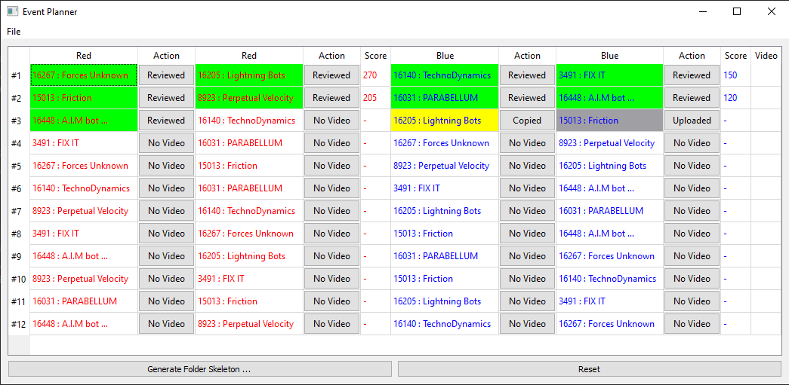

# VirtualGameEvent
- Design for FTC remote event, such as 2020/2021 Ultimate Goal session, but it might also good for all other type of virtual competition.
- It's a way to composite game video stream to provide a similar experience as exciting live events in past.
- It's not meant to replace the official scoring software and process at all.
- It's open-source, feel free to use it for your event, and even better contribute to make this project better serve more teams.

# Offline Mode:


# Tutorials: 
- [Score Keeper](./docs/ScoreKeeper.md)
- [Referee](./docs/Referee.md)
- Video Publisher

# Prerequisite : 

- Python : > 3.8.7 (install from: https://www.python.org/downloads/, support Windows, MacOS, and Linux)
- ffmpeg : > 4.2 (install from: https://ffmpeg.org/download.html, support Windows, MacOS, and Linux)
- vlc : > 3.0 (install from: https://www.videolan.org/vlc/index.html, support Windows, MacOS, and Linux)

# Setup : 
- $ pip install pipenv
- $ pipenv install --dev

## Launch Event Planner:

- Download the latest release code for Windows, and run event-planner.exe

or 

- Run following command from the checkout folder: 
  pipenv run python event-planner.py

or 

 - pipenv run python event-planner.py path/to/event.db
## Launch Match Video Processor:

- Download the latest release code for Windows, and run match-video-processer.exe

or 

- Run following command from the checkout folder: 
  pipenv run python match-video-processer.py

or 

 - pipenv run python match-video-processer.py path/to/game-video.mp4


## Launch Game Producer:

  pipenv run python GameProducer/bin/producer.py --help

# Components: 

- Event Planner:
  - Read the composition of each match and team information defined in FTC score software
  - Generate folder structure and skeleton of match manifest files
    - Team Uploads : A folder for individual teams to upload their game videos, organized by team by match
    - Game Matches : Stored match manifest and video manifest files by match, and referee should run Match Video Processor to review game
    - Match Video Published : Store the generated match videos for publish
  - Monitor these folders, and report the progress of each video, match
  - TBA : Save the score back to FTC score software

- Match Video Processor:
  - Download the game video from various of sources (Google Drive, Youtube, etc.)
  - Collect information to ["video manifest"](#video-manifest) file, such as:
    - Offset time in the video when game started
    - A series events happened in the video, such as task accompanished or penalty given
      - Offset time of event in the video
      - Description
      - Points changed

- Game Producer:
  - Take the ["match manifest"](#match-manifest) and ["video manifest"](#video-manifest) file as input, and composite the virtual game video for preview or save
  
- Game Publisher:
  - Take the virtual game video and publish to target streaming platform (Youtube, Twitch, etc)

# Screenshots:
- Event Planner

- Match Video Processor

- Video Producer


- Check out the examples folder for more details

# Examples of manifest files:
## Video Manifest:
```yaml
GameStartOffset: 0:28
GameEvents:
- Time: 0:35
  Description: "Power Shot Target #A Launched"
  Point: 15
- Time: 2:07
  Description: "Launched Rings into High Goal"
  Point: 6
- Time: 2:13
  Description: "Launched Rings into Medium Goal"
  Point: 4
- Time: 2:41
  Description: "#1 Wobble Goal Delivered to Drop Zone"
  Point: 20
- Time: 2:55
  Description: "#2 Wobble Goal Delivered to Drop Zone"
  Point: 20
```
## Match Manifest:
```yaml
VirtualGame:
  Name: FTC 16031 Parabellum League 2 vs League 3
  Teams:
  - TeamName: Parabellum League 2 Game 2 
    TeamNumber: 16031
    Alliance: Blue
    GameVideo:
      Location: League2/ftc16031-league2-game2.MP4
      VideoManifest: League2/ftc16031-league2-game2.yml
  - TeamName: Parabellum League 2 Game 3 
    TeamNumber: 16031
    Alliance: Blue
    GameVideo:
      Location: League2/ftc16031-league2-game3.MP4
      VideoManifest: League2/ftc16031-league2-game3.yml
  - TeamName: Parabellum League 3 Game 5 
    TeamNumber: 16031
    Alliance: Red
    GameVideo:
      Location: League3/ftc16031-league3-game5.MP4
      VideoManifest: League3/ftc16031-league3-game5.yml
  - TeamName: Parabellum League 3 Game 6
    TeamNumber: 16031
    Alliance: Red
    GameVideo:
      Location: League3/ftc16031-league3-game6.MP4
      VideoManifest: League3/ftc16031-league3-game6.yml
```
# Current status:
- Defined "match manifest" and ""video manifest" file formats
- Major feature of Event Planner and Match Video Processor has been implemented
- TBA : 
  - Write the score back to FTC score software database
  - Fine tuning of Event Planner UI


