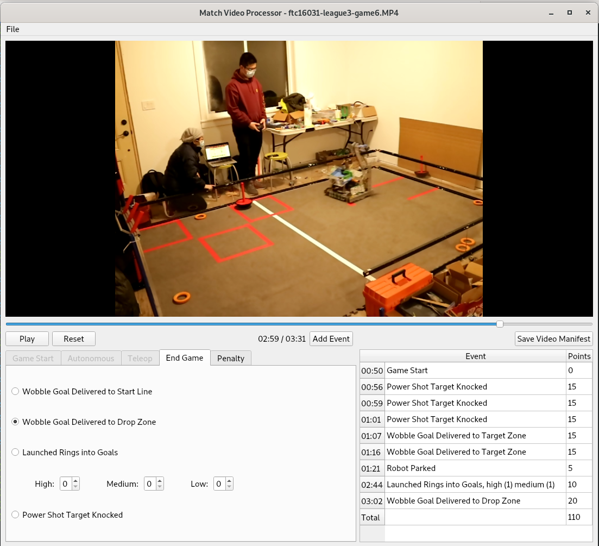
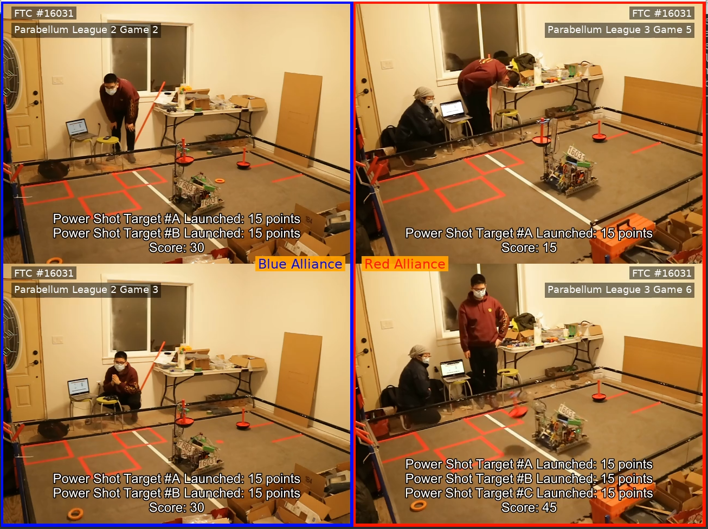

# VirtualGameEvent
- Design for FTC remote event, such as 2020/2021 Ultimate Goal session, but it might also good for all other type of virtual competition.
- It's a way to composite game video stream to provide a similar experience as exciting live events in past.
- It's not meant to replace the official scoring software and process at all.
- It's open-source, feel free to use it for your event, and even better contribute to make this project better serve more teams.

# Offline Mode:


# Prerequisite : 

- Python : > 3.8 (install from: https://www.python.org/downloads/, support Windows, MacOS, and Linux)
- pipenv : $ pip install pipenv
- ffmpeg : > 4.2 (install from: https://ffmpeg.org/download.html, support Windows, MacOS, and Linux)
- vlc : > 3.0 (install from: https://www.videolan.org/vlc/index.html, support Windows, MacOS, and Linux)

# Setup : 

- $ pipenv install --dev

# Components: 

- Event Planner:
  - Make composition of each match, and produce a ["match manifest"](#match-manifest) file like following example
  - Should hook up with FTC official scoring program to load game data from there.

- Match Video Processor:
  - Download the game video from various of sources (Google Drive, Youtube, etc.)
  - Collect information to ["video manifest"](#video-manifest) file, such as:
    - Offset time in the video when game started
    - A series events happened in the video, such as task accompanished or penalty given
      - Offset time of event in the video
      - Description
      - Points changed

- Game Producer:
  - Take the ["match manifest"](#match-manifest) and ["video manifest"](#video-manifest) file as input, and composite the virtual game video for preview or save
  
- Game Publisher:
  - Take the virtual game video and publish to target streaming platform (Youtube, Twitch, etc)
  
# Screenshots:
- Match Video Processor

- Video Producer


- Check out the examples folder for more details

# Examples of manifest files:
## Video Manifest:
```yaml
GameStartOffset: 0:28
GameEvents:
- Time: 0:35
  Description: "Power Shot Target #A Launched"
  Point: 15
- Time: 2:07
  Description: "Launched Rings into High Goal"
  Point: 6
- Time: 2:13
  Description: "Launched Rings into Medium Goal"
  Point: 4
- Time: 2:41
  Description: "#1 Wobble Goal Delivered to Drop Zone"
  Point: 20
- Time: 2:55
  Description: "#2 Wobble Goal Delivered to Drop Zone"
  Point: 20
```
## Match Manifest:
```yaml
VirtualGame:
  Name: FTC 16031 Parabellum League 2 vs League 3
  Teams:
  - TeamName: Parabellum League 2 Game 2 
    TeamNumber: 16031
    Alliance: Blue
    GameVideo:
      Location: League2/ftc16031-league2-game2.MP4
      GameManifest: !include League2/ftc16031-league2-game2.yml
  - TeamName: Parabellum League 2 Game 3 
    TeamNumber: 16031
    Alliance: Blue
    GameVideo:
      Location: League2/ftc16031-league2-game3.MP4
      GameManifest: !include League2/ftc16031-league2-game3.yml
  - TeamName: Parabellum League 3 Game 5 
    TeamNumber: 16031
    Alliance: Red
    GameVideo:
      Location: League3/ftc16031-league3-game5.MP4
      GameManifest: !include League3/ftc16031-league3-game5.yml
  - TeamName: Parabellum League 3 Game 6
    TeamNumber: 16031
    Alliance: Red
    GameVideo:
      Location: League3/ftc16031-league3-game6.MP4
      GameManifest: !include League3/ftc16031-league3-game6.yml
```
# Current status:
- Still at the earlier stage, many features are just planned not implemented
- Defined "match manifest" and ""video manifest" file formats
- A first working version of producer script is done
- A first working version of GameVideoProcessor is done


